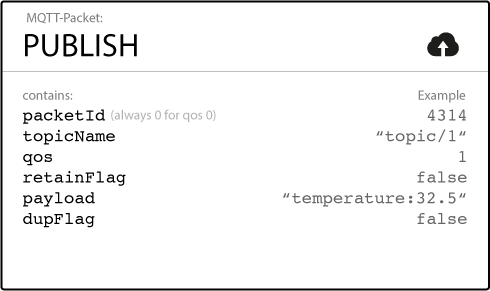

# OSMstream
The repository provides a docker container which collects the Augmented diffs (change sets) from OpenStreetMap.
The diffs are provided in XML format and can be accessed over the overpass API. For further use we convert them into JSON format and publish them with apache kafka.
After that the data is ready for a streaming database of your choice.


## Installation
Pull the repository, build the docker container and run the container.

### Docker
```shell
cd OSMstream
docker build -t osmstream .
docker run -d --name osmstream -p 2181:2181 -p 9092:9092 osmstream
```

If you'd like to verify if there is something going on, use the following command.
```shell
docker exec -it osmstream bash
/opt/kafka_2.11-0.10.0.1/bin/kafka-console-consumer.sh --zookeeper localhost:2181 --topic osm --from-beginning --consumer.config /opt/kafka_2.11-0.10.0.1/config/consumer.properties
```


## Usage
To test your streaming database with the OSM diff data provided by kafka.
This diffs could be relatively large messages for kafka, thus we recommend to set the "fetchSizeBytes" of your stream processing technology to something about 100'000'000.

### Kafka settings
- Host:     localhost, or docker0 ip of container
- Port:     2181, 9092
- Topic:    osm, benchmark

### Connect to kafka
If you connect to the osmstream docker container outside of the container you should use the docker0 IP of this container.
How to get the IP? Use the following command.

```shell
docker exec osmstream /bin/sh -c "ip add show eth0 | grep -Eo 'inet \S+'"
```

This IP Address is also automatically added to the kafka server.properties as advertised.host.name

### Test Data
Because there were several problems with the Augmented diffs, we recorded ten of them.
They can published to kafka with the "test_diff.py" script.
Usage (inside the docker container and better stop the cron service, which fetches the diffs):
```shell
service cron stop
python3 /opt/OSMstream/test_diff.py
```


## Benchmak
Benchmarking is a very difficult topic and strongly depends on various parameters like the underlying hardware.
Thus we decide to make this as hardware independent as possible.

The idea is to produce a lot of small kafka message, like IoT does, and to count all the words of them.
Then repeat this process and relate the number of processed messages with the time spent to count the words of them.

### Setup

The "benchmark.py" script produces the messages as a kafka producer and can be used like in the next box. (The parameter IP and Port are optional)

```shell
usage: benchmark.py [-h] -n NUMBER_OF_MESSAGES [-i IP] [-p PORT]

Produce input for stream benchmarks.

optional arguments:
  -h, --help            show this help message and exit
  -n NUMBER_OF_MESSAGES, --number_of_messages NUMBER_OF_MESSAGES
                        Number of messages to produce.
  -i IP, --ip IP        IP address of Kafka. (Default is localhost)
  -p PORT, --port PORT  Port of Kafka. (Default is 9092)
```


Example usage:
```shell
docker exec -it osmstream bash
python3 /opt/OSMstream/benchmark.py -n 1000
```


### Small Messages
The small messages are inspired by MQTT.



This messages are only generated samples for testing and look like the following.

```csv
packetId TopicName qos retainFlag payload false
0        weather   5   False      83      True
1        computer  2   True       82      False
2        weather   9   False       6      False
3        icebox    3   True       85      True
4        door      6   False      48      True
5        door      5   True        7      False
```

## Links
- http://wiki.openstreetmap.org/wiki/Overpass_API/Augmented_Diffs
- http://wiki.openstreetmap.org/wiki/Planet.osm/diffs
- http://wiki.openstreetmap.org/wiki/OsmChange
- https://en.wikipedia.org/wiki/MQTT
